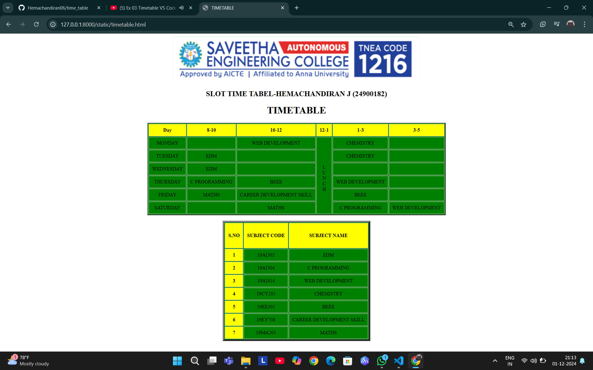

# Ex03 Time Table
# Date:1-12-2024
# AIM
To write a html webpage page to display your slot timetable.

# ALGORITHM
## STEP 1
Create a Django-admin Interface.

## STEP 2
Create a static folder and inert HTML code.

## STEP 3
Create a simple table using `<table>` tag in html.

## STEP 4
Add header row using `<th>` tag.

## STEP 5
Add your timetable using `<td>` tag.

## STEP 6
Execute the program using runserver command.

# PROGRAM
```
<!DOCTYPE html>
<html lang="en">
<head>
    <meta charset="UTF-8">
    <meta name="viewport" content="width=device-width, initial-scale=1.0">
    <title>TIMETABLE</title>

    <style>
		  
        <style>
    table {
        width: 100%;
        border-collapse: collapse;
    }
    th, td {
        border: 1px solid #ccc;
        padding: 10px;
        text-align: center;
    }
    th{
        background-color:yellow;
    }
    td,table{
        background-color: green ;
    }
</style><center>
    
<h2>SLOT TIME TABEL-HEMACHANDIRAN J (24900182)</h2></center>


</head>
<body> 

    <center><h1>TIMETABLE</h1></center>
    <table align="center" border="2" cellpadding="6" cellspacing="2">
        <tr>
            <th>Day</th>
            <th>8-10</th>
            <th>10-12</th>
            <th>12-1</th>
            <th>1-3</th>
            <th>3-5</th>
        </tr>

        <tr>
            <td>MONDAY</td>
            <td>   </td>
            <td>WEB DEVELOPMENT</td> 
            <td rowspan="7"><br>L<br> U <br> N <br> C  <br> H </td>
            <td>CHEMISTRY</td>
            <td>    </td>

        </tr>

        <tr>
            <td>TUESDAY</td>
            <td>EDM</td>
            <TD>   </TD>
            <TD>CHEMISTRY</TD>
            <td>    </td>
        </tr>

        <tr>
            <td>WEDNESDAY</td>
            <td>EDM</td>
            <td></td>
            <td></td>
            <td></td>
        </tr>

        <tr>
            <td>THURSDAY</td>
            <td>C PROGRAMMING</td>
            <td>BEEE</td>
            <td>WEB DEVELOPMENT</td>
            <td></td>
        </tr>

        <tr>
            <td>FRIDAY</td>
            <td>MATHS</td>
            <td>CAREER DEVELOPMENT SKILL</td>
            <td>BEEE</td><td></td>
        </tr>

        <tr>
            <td>SATURDAY</td>
            <td></td>
            <td>MATHS</td>
            <td> C PROGRAMMING</td>
            <td>WEB DEVELOPMENT</td>


        </tr>
    </table>


    <br>
    <table border="5" cellpadding="7" cellspacing="2" align="center">
        <tr>
          <th><h4>S.NO</h4></th>    
          <th><h4>SUBJECT CODE </h4></th>
          <th><h4>SUBJECT NAME </h4></th>
        </tr>
        <tr>
           <th>1</th>
           <td>19AI302</td>
           <td>EDM</td>
        </tr>
        <tr>
            <th>2</th>
            <td>19AI304</td>
            <td>C PROGRAMMING</td>
         </tr> 
         <tr>
            <th>3</th>
            <td>19AI414</td>
            <td> WEB DEVELOPMENT</td>
         </tr> 
         <tr>
            <th>4</th>
            <td>19CY205</td>
            <td>CHEMISTRY</td>
         </tr>
          <tr>
            <th>5</th>
            <td>19EE305</td>
            <td>BEEE</td>
         </tr>

         <tr>
          <th>6</th>
         <td>19EY708</td>
         <td>CAREER DEVELOPMENT SKILL </td>
         </TR>

         <TR>
            <TH>7</TH>
            <TD>19MA201</TD>
            <TD>MATHS</TD>
         </TR>
            </table>
        </table>
</body>
</html>
    
```
# OUTPUT

# RESULT
The program for creating slot timetable using basic HTML tags is executed successfully.
